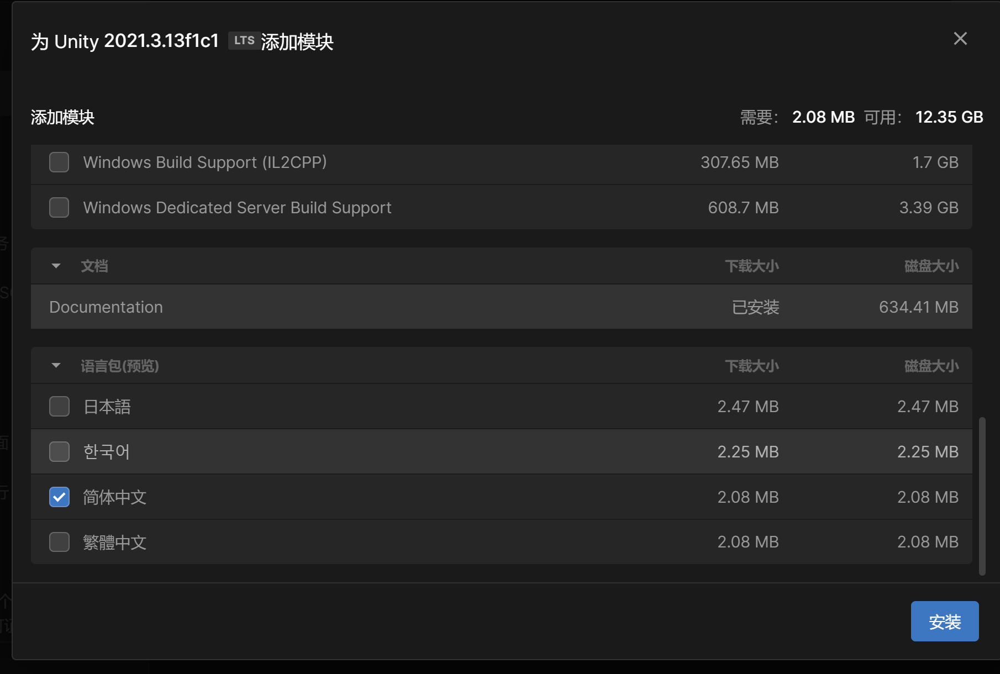

## 这里是入门的地方，万物的起点

### 一、准备工作
- Unity的下载与使用

  [下载地址](https://unity.cn/releases/full)

 
 { loading=lazy; with="100";}

首先下载Untiy Hub

{ loading=lazy; with="100";}

 下载之前可能会让你创建UnityID,创建完成之后，就能下载了，唯一需要注意的可能就是unity的下载地址要放在一个内存大的地方，
 如果有两个盘就尽量不要给C盘内存搞红了

下载完成后，打开UnityHub点击安装编辑器

这里推荐安装长期支持版本（LST）

- IDE的安装

IDE一般为Visual Studio,jetBrains的Rider也可以

如何申请jetBrains的学生认证，请移步本网站的工具->编辑器推荐->jetBrains

这里附上[Visual Studio的官网](https://visualstudio.microsoft.com/zh-hans/downloads/)

### 二、第一个项目
- 完成第一个Unity项目吧
- [滚动的小球](https://www.bilibili.com/video/BV1bW411a7U6)

### 三、可能会遇到的问题

1、打开项目，全是英文，看不懂英文怎么办？？？

首先在UnityHub的安装中找到你已经安装的Unity版本，点击它右边的小齿轮，选择添加模块

滑到最下边选中简体中文，点击安装

之后打开你的项目，在左上角的菜单栏中选中Edit->Preferences...

打开之后就可以看到语言选项了，将English改成简体中文即可

2、如何设置脚本的IDE

同样我们打开一个项目，在菜单栏中选中Edit(编辑)->Preferences...(首选项)

选择External Tool(外部工具) -> External Script Editor(外部脚本编辑器)
选择你使用的编辑器即可

3、无法挂载脚本

- 错误1

这里我创建了一个名为TTest的脚本，脚本内容如下

但是我将它挂在一个游戏物体上的时候出现如下图报错

这是新手比较常见的错误（文件名与类名不匹配）

这里将脚本里边的代码class后面的Test改为TTest
或者将改脚本的名字重命名为Test即可

- 错误2

如果我们的Test脚本内容变为这样

此时我们尝试将Test脚本挂载在一个游戏物体上时会有下图报错

这是我们试图将一个没有继承自MonoBehaviour的类挂载给一个物体

这里就需要我们将Test脚本里的Test后面加上": MonoBehaviour"

