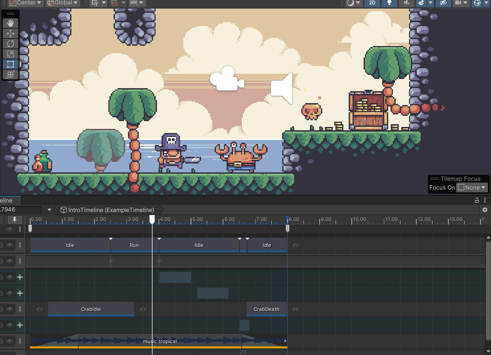
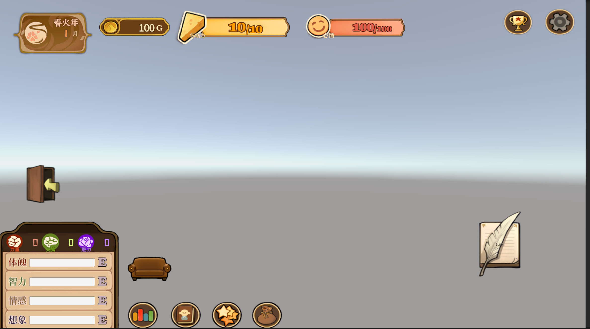
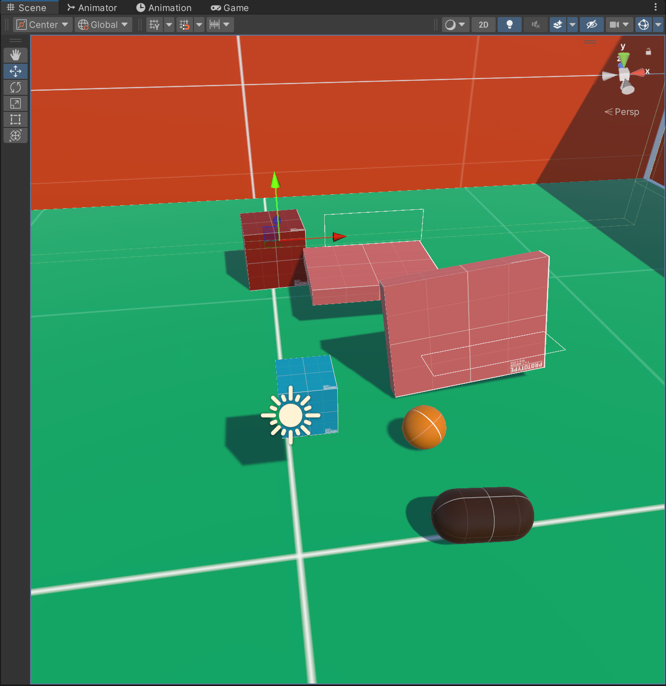
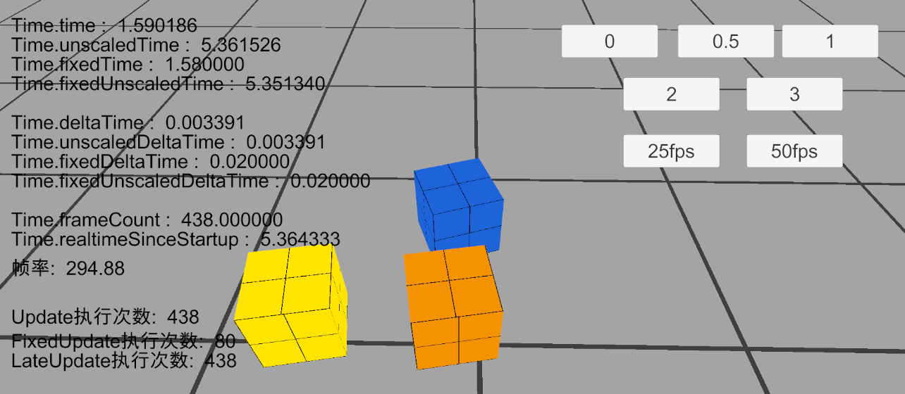

## 这里将会放置从2024年9月第一次开会起的会议内容,供大家复习参考
-----
- [2024-9 Timeline](../../c-xingsi/game/game_meetings/2024-9_Timeline.md)

- [2024-10 UI基础](../../c-xingsi/game/game_meetings/2024-10_UI.md)

- [2024-11 物理系统基础](../../c-xingsi/game/game_meetings/2024-11_Unity_Physical System.md)

- [2025-3 重要类-Time类](../../c-xingsi/game/game_meetings/2025-3_Time.md)

