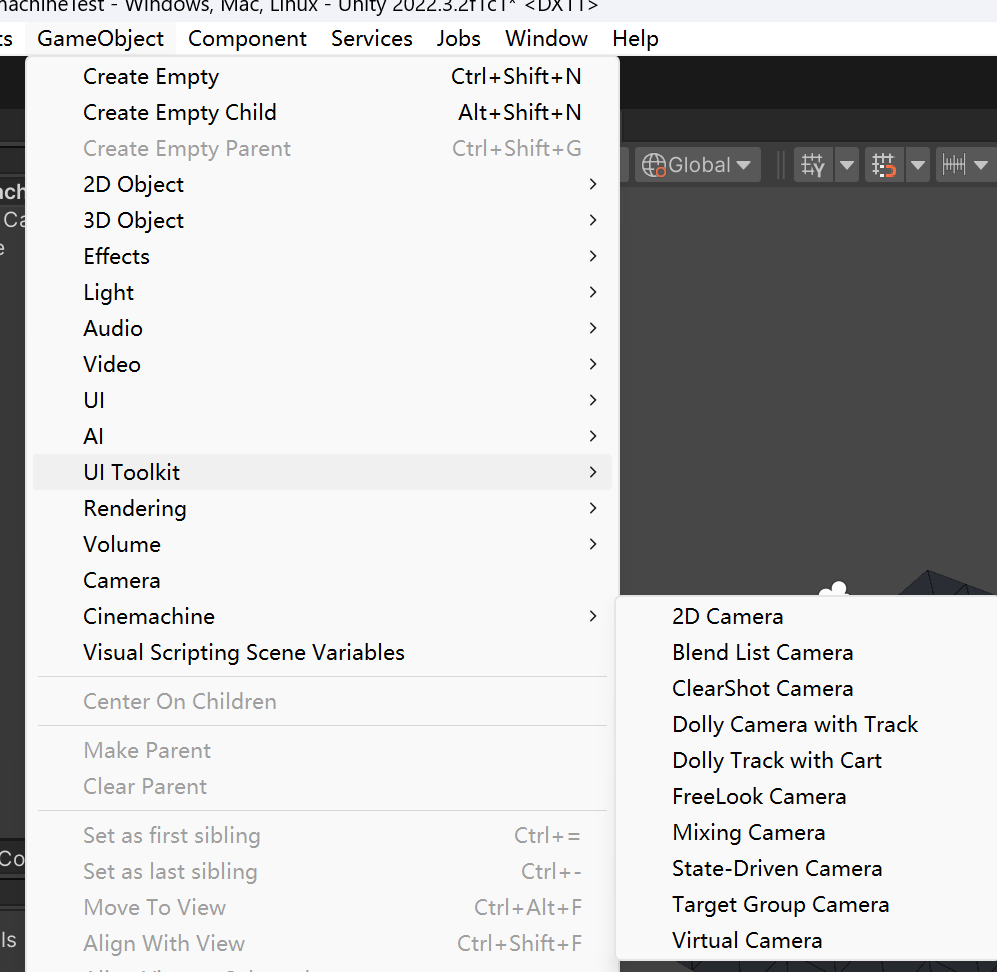

# Cinemachine 

---
## 一、什么是Cinemachine
    Cinemachine 是一套用于操作 Unity 摄像机的模块，是一个十分方便的组件。
    Cinemachine解决了跟踪目标、合成、混合和镜头之间剪辑的复杂数学和逻辑问题，
    减轻了我们自己编写摄像机脚本（Debug）的痛苦。

你可以在任何需要使用到摄像头的地方使用它，按照你的需求添加镜头，十分简单的实现一些看起来高级的功能

## 二、下载与使用
### 1、下载
 那么这么好用的插件怎么下载呢？
 
很幸运的是，它是免费的，我们可以像下载其他软件包一样在Window->Package Manager->搜索Cinemachine下载

需要注意的是，最好你的Unity版是2019.4+ 及更高版本，不然可能不支持

### 2、使用
在下载完成之后，我们在Hierarchy界面右键即可看到Cinemachine

当然我们也可以在GameObject下找到

