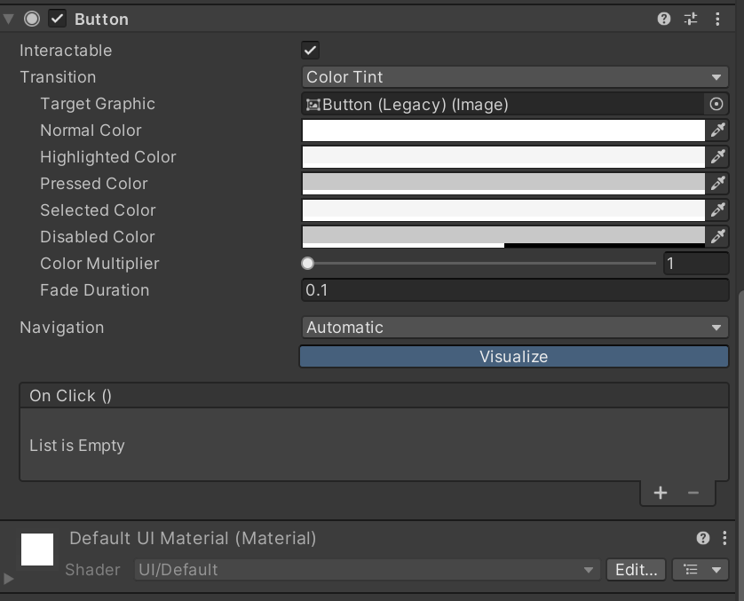

# UGUI

## 前言
UGUI是Unity内置的UI系统，其他的还有NGUI、IMGUI等。UGUI是Unity最常用的UI系统。

一个基本UGUI界面是由三个部分组成：

- 1.Canvas画布：渲染所有的UI元素。

- 2.构成UI的元素：图片、按钮、文本等。

- 3.EventSystem：UGUI的所有事件系统都依赖EventSystem组件来完成，如果没有这个物体，那么像按钮点击之类的交互效果便没有办法使用了。

## 一、Canvas

    是所有 UI 元素都应该位于其中的区域。Canvas 是带有 Canvas 组件的游戏对象，所有 UI 元素都必须是此类 Canvas 的子项

Canvas 使用 EventSystem 对象来帮助消息传递系统,因此EventSystem对象也十分的重要，如果没有EventSystem，将无法与UI进行交互

Canvas组件介绍详见[官方文档](https://docs.unity3d.com/Packages/com.unity.ugui@2.0/manual/comp-CanvasComponents.html)

## 二、UI组件

由于TextMeshPro的引入，原本拥有Text的ui(如：Text,Button,DropDown,InputField)被放在Legacy(过时)栏中

如果之前没有创建过Canvas(画布)，那么在创建任意UI对象的时候，都会创建一个Canvas和一个EventSystem.

在新创建的UI对象上会自动添加对应的UI组件

### 1、Text组件

#### 简析Text组件属性

    Font: 使用的字体
    Font Style: 字体格式:Normal(正常)、Bold(粗体)、Italic(斜体)、 Bold And Italic(粗并且斜).
    Font Size: 字体大小
    Line Spacing: 行距
    Rich Text: 是否使用富文本
    Alignment: 文本水平和垂直对齐方式
    Align by Geometry: 是否使用字形几何图形的范围来执行水平对齐，而不是字形度量。
    Horizontal Overflow: 用于处理文本太宽而无法放入矩形的情况的方法。选项包括 Wrap(截断) 和 Overflow(溢出)。
    Vertical Overflow: 用于处理文本太高而无法放入矩形的情况的方法。选项包括 Truncate(截断) 和 Overflow(溢出)。
    Best Fit: 是否无视Font Size的设置，自动调整文本大小
    Color: 字体颜色

### 2、Image组件

#### <1> 简析Image组件属性

    Source Image: 源图片. 注：这里的源图片的纹理为Sprite(精灵)
    Color: 图片颜色
    Set Native Size: 将图像框的尺寸设置为纹理的原始像素大小
#### <2> 如何将图片资源的纹理(Texture)设置为Sprite格式

详细设置查看[官方文档](https://docs.unity.cn/cn/2022.3/Manual/class-TextureImporter.html)

当我们点击加入到Unity项目中的图片时，它的Texture Type为Default，这种类型的图片无法作为图片源给到Image,我们需要将它的Texture Type改为Sprite(2D and UI),并Apply

### 3、RawImage组件

该组件与Image组件类似，但它对图片的纹理类型没有要求，也就是说，它可以显示下载的图像，也可以显示游戏中对象的纹理

#### 属性简析

    Texture: 图片纹理
    Color: 图片颜色
    UV Rect: 通过调整该属性可以实现只显示一部分纹理的效果，X 和 Y 坐标指定图像的哪个部分与控件的左下角对齐。W 和 H （即 width 和 height） 属性指示将缩放以适应控件矩形的图像部分的宽度和高度

### 4、Mask 组件

该组件需要手动添加给需要的游戏对象

#### 如何使用

拥有该组件的ui对象，可以根据自身形状来遮盖其子物体超出自身的部分

    遮盖的前提是子物体的Maskable属性是被勾选的

拓展一下：[反遮罩（镂空效果）怎么制作](https://blog.csdn.net/qq258456qq/article/details/104917878),这种用法在新手引导中常见

### 5、Button组件

#### 属性简析

    Interactable: 是否可以交互
    Transition : 
        None(什么都不做）: 一般当我们选择使用代码控制Button行为的时候会选择这个选项

        Color Tint(色彩调和)
            Target Graphic: 要改变颜色的图片
            Normal Color: 正常状态下的颜色
            Hightlighted Color: 高亮（鼠标移到该处）状态下的颜色
            Pressed Color: 按下时的颜色
            Selected Color: 被选中（按下之后就处于被选中状态）时的颜色
            Disabled Color: 被禁用（禁用交互）时的颜色

        Sprie Swap(切换精灵？图)
            Target Graphic: 要切换精灵图的图片
            Highlighted Sprite: 高亮时要切换的精灵图
            Pressed Sprite: 按下时要切换的精灵图
            Selected Color: 被选中（按下之后就处于被选中状态）时的要切换的精灵图
            Disable Color: 被禁用时要切换的精灵图

        Animation(动画)
            Normal Trigger: 正常状态下要触发的动画片段名称
            Hightlighted Trigger: 高亮时要触发的动画片段名称
            Pressed Trigger: 被按下时要触发的动画片段名称
            Selected Trigger: 被选中时要触发的动画片段名称
            Disable Color: 被禁用时要触发的动画片段名称
            Auto Generate Animation:自动给当前的生成一个动画控制器包含五个空动画片段

自动生成的动画控制器

### 6、Toggle组件与Toggle Group组件

创建出来的Toggle游戏对象分为两部分

- **Label(标签)** : 一个Text游戏对象，说明Toggle的名字

- **Background(选项背景)** : Toggle选项的背景

- **Checkmark** Toggle被选中的图标

#### <1> Toggle属性简析
    Is On:是否选中
    Toggle Transition: Toggle的切换方式。Fade(渐变)、None(立即切换)
    Group:该Toggle所属于的Toggle组

#### <2> Toggle Group

Toggle Group组件需要手动添加到一个游戏对象上,一般是在Canvas下创建一个空游戏物体，给他添加一个Toggle Group

#### 属性解析
    Allow Switch Off: 允许空选

Toggle Group用于需要管理一些Toggle时使用。

我们可以通过将拥有Toggle Group的游戏对象赋值给Toggle的Group属性上，达成属于同一Group的Toggle在同一时间只能有一个或零个被选中的目的。

### 7、Slider组件
    Slider 控件允许用户通过拖动鼠标从预定范围内选择数值。熟悉的示例包括游戏中的难度设置和图像编辑器中的亮度设置。

Slider对象由三部分组成

 - Background(背景): 灰色的部分（一个image）

 - Fill Area(填充范围): 填充的范围，自身没有任何组件，更改其大小即可更改填充范围。其子物体——Fill为填充物（一个image）

 - Handle Slide Area(“手柄”滑动范围): “手柄”可滑动的范围，同样的改变其大小可更改填充范围，其子物体——Handle为可拖动的“手柄”（一个image）

有时候不想要Handle可以直接将Handle Slider Area删去，Slider可能会警告，这是因为Slider的Target Graphic失去目标了，我们再给他赋个值就行了

#### 属性简析
    Fill Rect: 填充物的RectTransfrom
    （Slider通过控制填充物的RectTransform来实现填充的效果）
    Handle Rect: "手柄"的RectTransform
    （同样的，Slider通过控制"手柄"的RectTransform实现相关效果）
    Direction: 填充方向（自左到右、自右到左、自下到上、自上到下）
    Min Value: value的最小值
    Max Value: value的最大值
    Whole Numbers: Value使用整数

## 三、TMP简析

#### <1> 属性
TMP（UI）与TMP（3D）组件属性：[官方文档](https://docs.unity3d.com/Packages/com.unity.ugui@2.0/manual/TextMeshPro/TMPObjectUIText.html)

#### <2>字体资源
TextMesh Pro 有自己的字体资源格式，该格式不同于 Unity 的常规字体资源格式，但与 Unity 的常规字体资源格式相关。

常规字体资源

TMP字体资源

#### <3>如何创建TMP字体资源

选中一个字体资源->Create->TestMeshPro->Font Asset

#### <4>静态字体资源与动态字体资源

- 静态字体资源：每次需要使用新的字符，都要在Font Asset Creator中添加新字符到字符图中去

- 动态字体资源：不需要每次在Font Asset Creator中添加字符，会自动更新字符图，但会更消耗性能

我们可以在制作项目的时候用动态字体资源，当项目完成后，将TMP字体资源改为静态的并生成。
#### <5> 创建静态字体资源

准备:
- 一个中文字体
- 一个常用字的txt文件 

例如:中文常用5000字的txt文件

打开字体资源创建窗口

- 首先在Source Font File(字体源文件)放入我们准备的中文字体，
- 在Character Set选中Catarcter from File(从文件中选取字符)
- 在Character File放入我们的常用字的txt文件
- 如果txt文件中的字符比较多，可以将Altas Resolution从1024x1024调到2048x2048
- 然后就可以生成字体图了，点击Generate Font Atlas
- 生成之后，就可以保存生成一个TMP的字体文件了
- 

我们在TMP字体文件的Inspector界面上也可以看到他的模式是静态的

#### <6> 创建动态字体资源
动态字体资源的创建相较于静态字体资源的创建更简单，直接选中一个字体文件，右键创建TMP字体资源即可

它与静态字体资源不同的是，它生成的字体图是会随着你使用该字体表示字符的增加而更新

#### <7>添加额外的字符
有时候我们找的中文字体中会缺少某些特殊字符，但我们又不想使用新字体怎么办？

这时候就用到我们TMP字体的Fallback Font Assets

我们可以将缺少的字符存放在一个Unicode编码的txt文件里，将该txt文件拖到Unity中，并通过Font Asset Creator生成静态的字体资源

将该字体资源给到我们缺少这些字符的字体资源的Fallback Font Assets中
## 四、做个ui界面试试

####  资源
[字体与图片](https://pan.baidu.com/s/10h5j3iIXEyBrn1ecgC4Ong?pwd=7op4)

#### 最终效果

## 五、尚未完成项目

???+ abstract "TODO"

    - [ ] 基本布局: RectTransform、锚点（Anchor）、轴（Pivot）
    - [ ] 自动布局: Layout ELement、Layout Controllers、Layout Groups
    - [ ] 事件

 

