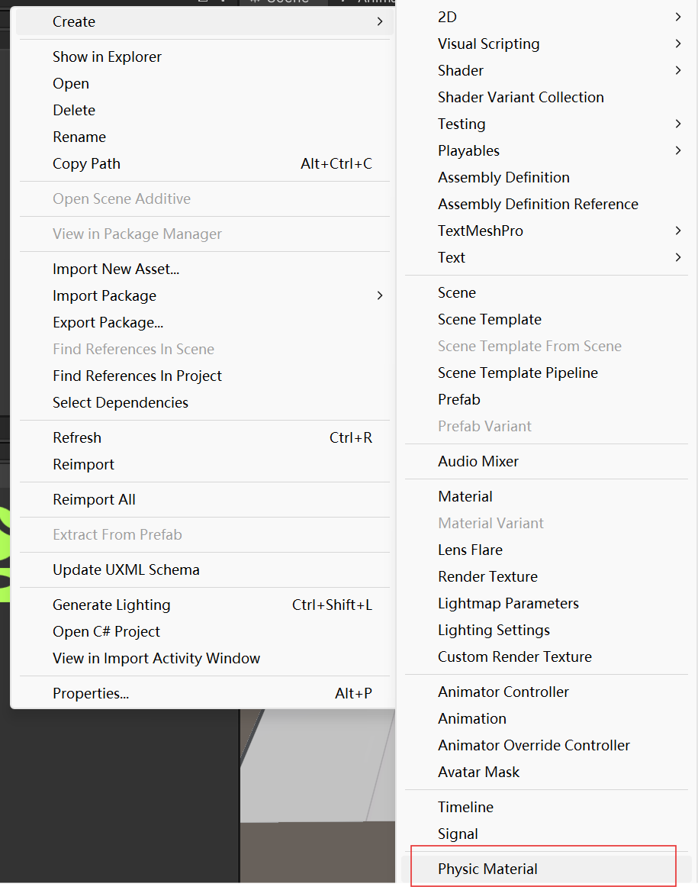

# Unity 物理系统

## 前言
游戏中对物理模拟实现是游戏一个十分重要的一个部分，不论是对游戏性还是真实度来都是不可或缺的系统。最简单的例子就是跳跃之后要落到地面上。

Unity作为游戏引擎，利用物理处理器 PhysX 专门负责物理方面的运算，物理系统主要是模拟对象受力的影响的效果和对象与对象之间的碰撞。

对于我们来说，我们不需要知道碰撞之后的效果怎么计算，我们只需要设置谁和谁可以碰撞就行了，对于受力也一样，我们只需要施加力，获取我们想要的结果即可，至于怎么计算的，我们不关心

Unity的物理系统给我们主要提供了以下几个方面的物理组件
    
    - Rigidbody(刚体)
    - Collider(碰撞体)
    - CharacterController(角色控制器)
    - Close(布料模拟)
    - Joints(关节)
    - ConstantForce(力场)

## 一、Rigibody(刚体)

刚体，顾名思义就是受力不会发生形变的物体。一个拥有Rigibody组件的游戏物体，当它收到外力的作用时，Unity的物理引擎就会计算并模拟它的行为， 如：翻滚、掉落。

### 刚体组件属性

- Mass 物体的质量，默认是千克。

- Drag 物体移动式受到的空气阻力。0表示没有阻力，设置为无穷大物体会立即停止移动。

- Angular Drag 物体选装时受到的空气阻力。0表示没有阻力，设置为无穷大物体并不会立即停止旋转。

- Use Gravity 物体是否受重力影响。

- Is Kinematic 是否时动力学物体。勾选后不再收物理系统控制，而是在脚本中通过Transform来移动物体。

- Interpolate 差值平滑方式。当刚体出现抖动时，可以尝试一下选项来解决：

    - None 不执行差值平滑算法
  
    - Interpolate 利用上一帧的位置进行平滑处理
  
    - Extrapolate 估算未来一帧的位置，并进行平滑处理
  
- Collision Detection 碰撞检测方式。当物体告诉运动时，由于帧数率有限，会穿过物体。根据物体运动速度选择一下碰撞检测方式。

    - Discrete 非连续，每帧之间的检测是独立的。该方式效率最高，是默认方式。
  
    - Continuous 连续检测方式。
  
    - Continuous Dynamic 连续动态检测方式。
  
    - Continuous Speculative 推断性 CCD
  
[什么是CCD](https://docs.unity3d.com/Manual/ContinuousCollisionDetection.html)

- Constraints 运动约束

    - Freeze Position 位移时，锁定x,y,z中的一个或多个轴。该限制是在世界坐标系内。
  
    - Freeze Rotation 限制刚体沿x,y,z轴的旋转。该限制是在局部坐标系内。
  
### 使用刚体的tips?

#### 1、理解父子关系中的物理行为

在Unity中，一般具有父子关系的游戏物体，当父物体运动时，子物体会跟随运动从而保持父子物体之间的相对位置

但当子物体具有刚体组件之后，即使子物体是父物体的子节点，子物体的物理运动仍然是独立的。

这就意味着，当子物体不受力（或者受力平衡时），此时子物体的位置随父物体改变而改变，

当子物体受力时，子物体将不再维持相对位置的关系，从而进行独立的物理运动

#### 2、如何施加力

具有Rigibody组件的游戏物体能够受到重力的影响、也能受到通过脚本施加的力，但想要与其他游戏物体发生碰撞等物理行为，就必须拥有另一个物理组件
Collider(碰撞器)

## 二、Collider(碰撞器)

### 1、为什么需要Collider组件？

- 碰撞检测 ：Collider组件使物体能够被物理引擎识别为参与碰撞的对象。没有Collider，物理引擎无法检测到物体的边界，自然也无法处理与其他物体的碰撞。

- 物理交互 ：当两个物体碰撞时，物理引擎需要知道它们的形状和位置，以便计算碰撞后的力和反应。如果一个物体缺乏Collider组件，物理引擎将无法正确地处理碰撞事件和力的施加。

可以思考一下，只有Rigidbody组件的游戏物体，只有Collider组件的游戏物体，以及二者都有的游戏物体，它们有什么不同？
### 2、Collider组件分类

为了应对能够给各种形状的游戏物体设置比较合理的Collider，Unity为我们提供了以下几种Collider；

-  BoxCollider: 立方体碰撞器

-  CapsuleCollider:Capsule Collider(胶囊体碰撞器) 由一个圆柱体盒两个半球组合而成，Capsule Collider 的半径和高度都可以单独调节，可用在角色控制器或与其他不规则形状的碰撞结合来使用

-  SphereCollider: 球体碰撞器

-  MeshCollider:Mesh Collider（网格碰撞器）根据 Mesh 形状产生碰撞体，比起 Box Collider、Sphere Collider 和 Capsule Collider，Mesh Collider 更加精确，但会占用更多的系统资源。
   专门用于复杂网格所生成的模型

-  TerrainCollider: （地形碰撞体）根据地形来生成一个整体的碰撞体，可以给地形上的树木也加上碰撞

-  WheelCollider: Wheel Collider（车轮碰撞器）是一种针对地面车辆的特殊碰撞体，自带碰撞侦测、轮胎物理现象和轮胎模型，专门用于处理轮胎。

### 3、Collider组件属性

#### BoxCollider

- Is Trigger 是否是触发器，勾选后变为触发器，会触发触发器事件，不再与刚体碰撞。
- Material 碰撞体物理材质。物理材质决定了摩擦力，弹性等。
- Center 中心点坐标（局部坐标系）。

该三个参数也是所有碰撞体的基本参数，后面的碰撞体将不再介绍这三个参数。

CapsuleCollider、SphereCollider与BoxCollider不同的就是调整大小的参数，这里不再赘述

#### MeshCollider

- Convex 是否使用凸体，勾选后会有Mesh生成凸体，并且最多有255个三角面。

- Cookinbg Options 打开或关闭物理引擎处理Mesh的选项，默认都是开启的.
    - None or Everything
  
    - Cook for Faster Simulation 开启后会执行额外的步骤，以保证生成的Mesh运行效率最优化。
  
    - Enable Mesh Cleaning 清理退化三角形，会让碰撞点更精确。
  
    - Weld Colocated Vertices 删除在相同位置的顶点
  
- Mesh 进行碰撞或生成凸体的网格。

## 三、Physics Material(物理材质)

当我们的游戏物体可以受到力的作用，可以与其他游戏物体发生碰撞，这时候我们的物理世界是否完整呢？

显然并不完整，因为我们此时并没有摩擦力、弹力这些力。当然Unity也考虑到了这一点，于是便有了物理材质这个东西。

点击之后，便会生成一个物理材质资源

参数：
- Dynamic Friction 动摩擦系数。物体之间正在滑动时起作用，通常为0-1。0类似冰面效果，1时滑动会很快停止。

- Static Friction 静摩擦系数。物体需要由静止到滑动切换时起作用，用来阻止启动滑动，通常为0-1。0类似冰面，1则很难滑动。

- Bounciness 弹性。为0，碰撞时不会反弹，为1时碰撞不会损失能量，持续反弹。

- Friction Combine 如何根据碰撞的两个对象各自的摩擦系数计算综合摩擦力。

  - Average 相加平均
  
  - Minimum 取最小值
  
  - Maximum 取最大值
  
- Multiply 两个摩擦系数相乘

- Bounciness Combine 如何计算弹性系数，同摩擦系数。

### 关于Combine的方式
当两个具有不同的Physics Material的游戏物体相互作用时，它们受到的摩擦力和弹力一定是一样的。所以当它们计算方式不同时，会根据优先级统一计算方式

优先级：Average<Minimum<Multiply<Maximum。

## 四、关于物理对象的分类

根据Rigidbody组件和Collider组件的属性设置不同从而有了不同的物理对象。

分别为：Dynamic、Kinematic、Static、Trigger

- Dynamic : 具有Collider类组件，具有Rigidody组件并且Is Kinematic选项未勾选

    Dynamic物体可以受到外力的影响，也可以与其他具有碰撞盒的物体发生碰撞

- Kinematic : 与Dynamic类似，但需要勾选Rigibody组件中的Is Kinematic选项

    
    Kinematic物体不受力的影响，其自身的运动由代码决定。可以与其他具有碰撞盒的物体发生碰撞，

- Static : 只具有Collider类组件的物体，勾选Static选项

  
    Static物体同样不受力的影响，可以与其他具有碰撞盒的物体发生碰撞。一般我们将场景中不会移动的物体设为Static

- Trigger : 需要将Collider类组件中的Is Trigger选项勾选

    Trigger的碰撞盒将只做逻辑上的检测，不会与其他物体发生碰撞

这几种物理对象的碰撞关系如下图

触发关系如下图

### Static与Kinematic辨析
这里的Static与Kinematic看起来似乎差不多，都是不受力的影响，都可以与动态物体发生碰撞。那么它们有什么不同呢？

#### 不同
- 适用物体的不同：Static适用于不移动且不受力影响的物体，通常用于固定场景元素，如地板、墙壁和地形。
  而Kinematic适用于需要精确控制运动的情况，如动画角色、移动平台等。

- Unity对它们的处理不同：Unity会对静态物体进行许多预计算和优化，因为这些物体通常不会移动。
  
  而那些可以移动的物体。Unity的物理引擎在每一帧中都会更新这些物体的位置、旋转和碰撞体的状态。
  
  与静态物体不同，动态物体在场景中移动时，Unity已经为这些物体的频繁更新做好了准备。Unity不会对这些物体进行一些昂贵的计算来优化。
  但是如果移动一个静态物体，那么Unity就必须在移动的每一帧都进行一些昂贵的计算，这就是我们不希望移动静态物体的原因。

## 五、尚未完成项目

???+ abstract "TODO"

    - [ ] 剩下的物理组件
