# Timeline （时间轴）

>前言：本次开会我们将配合一个[**案例**](https://drive.google.com/file/d/1rkF1akRX7pu-EmCrEeSsVMcfnstwG8PF/view?pli=1)讲解Unity中Timeline的简单使用

## 一、什么是Timeline
    Unity中的Timeline是一个强大的工具，用于创建和管理动画、音频、事件等元素的时间序列。
    
    它允许开发者通过直观的界面来编排和控制这些元素，从而实现复杂的动态效果和交互体验。

Timeline的主要功能包括：
- 动画控制：可以创建和编辑角色、道具等物体的动画序列。

- 音频管理：控制音频的播放、停止、淡入淡出等。

- 事件触发：在特定时间点触发自定义事件。

- 粒子效果：管理和控制粒子系统的动画。

简而言之，Timeline是一个十分方便，好用的动画生成器

## 二、如何安装
    注：该组件需要Unity 2019.3即以上版本
 
&emsp;&emsp;在 window -> Package Manager ->搜索
Timeline,即可查看是否安装Timeline包或者是否更新Timeline包的版本

## 三、Timeline的工作流

- 创建Timeline资源和Timeline实例
- 使用Animation轨道和 Infinite 剪辑将关键帧动画直接录制到 Timeline 实例
- 将 Infinite 剪辑转换为 Animation 剪辑

关键概念：Timeline资源与Timeline实例，各种轨道

### <1>、打开Timeline

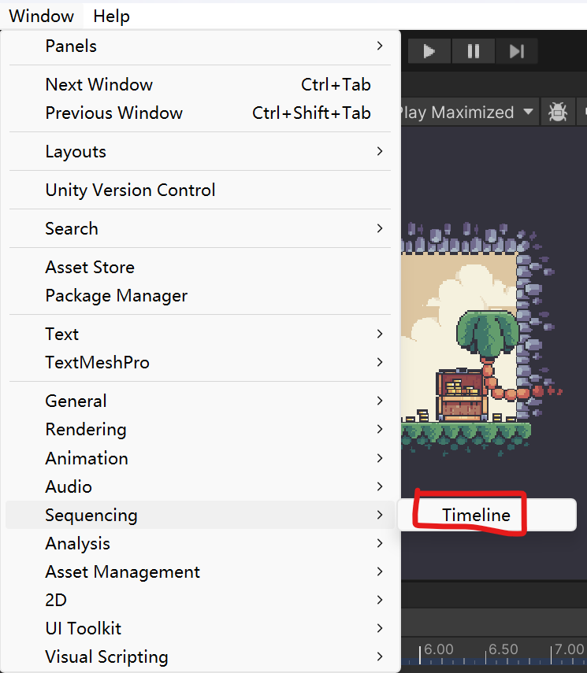
{ loading=lazy; width="100";}

### <2>、创建Timeline资源和Timeline实例

&emsp;&emsp;我们需要创建一个空物体来将Timeline与游戏对象相关联

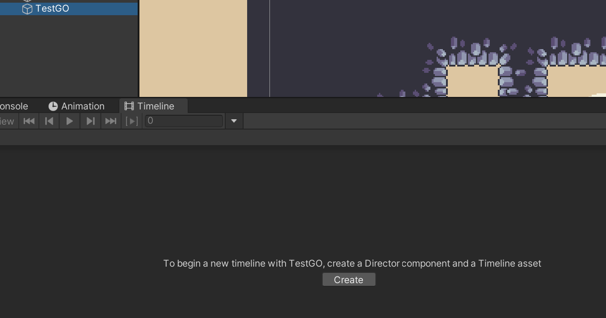

选取合适的物体后，即可创建我们的Timeline实例与Timeline资源了。

该物体会多出Playable Director组件

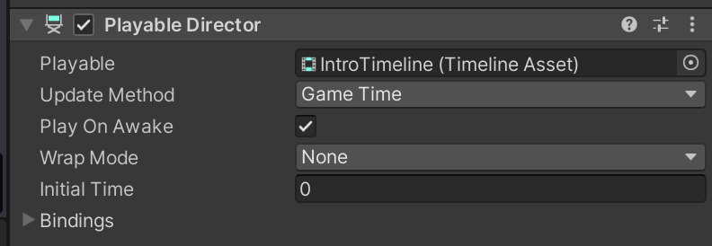

Playable Director 组件存储了Timeline实例（Timeline instance）与Timeline资源（Timeline Asset）间的连接。

Playable的一些属性：

    Play On Awake: 是否在Awake的时候播放 

    Update Method : 如何更新它的时钟（clock）

    Wrap Mode : Timeline实例播放结束后发生什么。

Playable Director组件还显示关联的Timeline资源（Playable属性）的轨道列表（Bindings属性）。

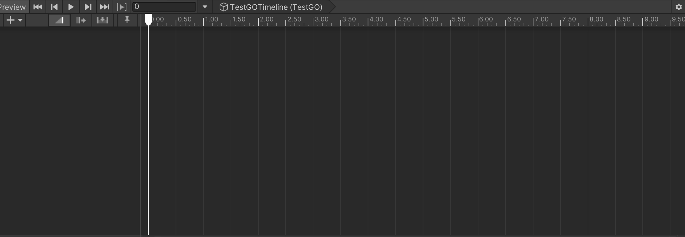
(这是创建的Timeline实例)

我们可以在左边黑色区域创建各种轨道

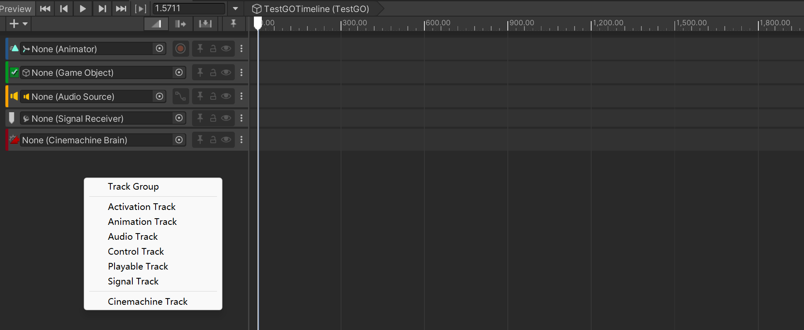

这里先介绍这几种轨道

     Activation Track : 活性轨道，我们可以在这个轨道中控制某个物体在哪些时刻的激活状态。

     Animation Track : 动画轨道，允许直接导入动画片段、或者直接在Timeline中重建动画

     Audio Track : 音乐轨道，与动画轨道类似，我们也可以在这里对音乐片段进行混合，控制它们的播放时机与顺序

     Control Track : 允许触发其他Timeline Sequences时间序列

     Playable Track :  允许触发其他Timeline Sequences时间序列

     Signal Track : 将Timeline和外部系统建立通信通道

     Cinemachine Track : 允许在Timeline内控制Cinemachine虚拟相机

其中不怎么常用，本次开会并会不会涉及的是Control Track与Playable Track

### <3>制作Timeline

**1、Animation Track**

我们选定一个游戏对象 **(拥有Animator组件)** ，为其创建一个动画轨道，我们就可以将它的动画 **(不能是拥有时间的动画)** 拖动到创建的动画轨道中去。
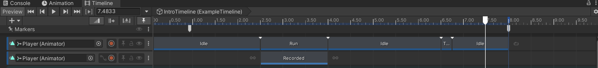

**2、Track Group**

当我们有两个及以上的需要搭配在一起使用的轨道时，我们可以为它们创建一个Track Group以便管理

例如：这里的AttackEffect的动画需要与它的激活状态同步，也就是动画启动它被激活，动画结束它被失活，我们就可以为它们创建一个Track Group来统一管理

**3、动画推断**

在我们向轨道中添加Asset时，我们会发现有时候它的两头会有两个循环的标志

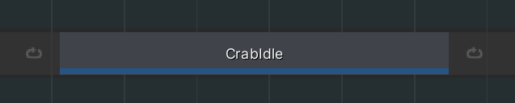

（这里使用动画轨道举例）
当出现这个标志时，就说明在进入这个动画之前，物体都会循环该动画，在结束该动画之后，也会一直循环，直到播放该轨道上的下一个动画

我们可以点击轨道上的这个动画，在检视界面更改它的Pre/Post-Extrapolate选项，这里两个都是loop。
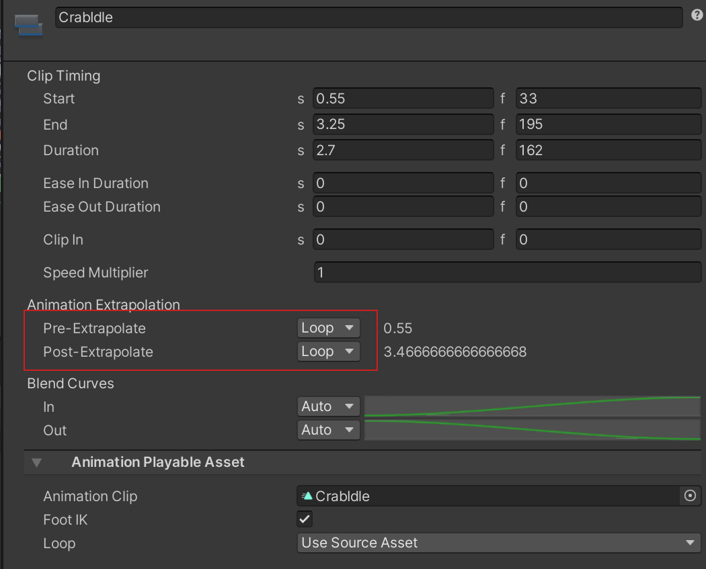
如果选择Hold选项，则会保持动画的第一帧/最后一帧。
如果选择None,则会保持前/后一个动画的最后一帧/第一帧。

**4、Audio Track**

我们选定一个游戏对象 **(拥有Audio Source组件)** ，为其创建一个轨道,我们就可以将AudioClip拖动到创建的动画轨道中去。

这里可看到Audio Track中的音频片段的开头与结尾并不完整。这是调整了它的属性的结果
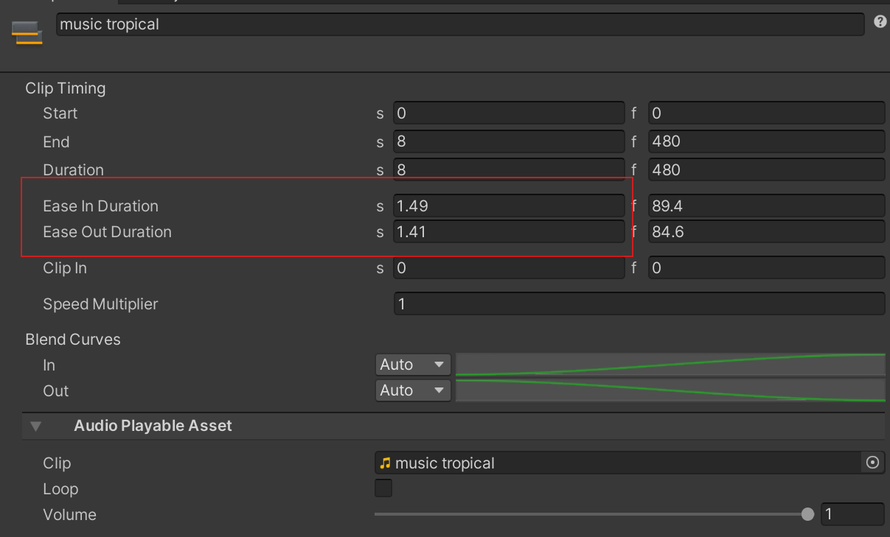

在这里适当增加Ease In Duration的s值可以实现音乐渐入的效果，同样的增加Ease Out Duration的s值可以实现音乐的渐出效果

**5、Signal Track**

这个轨道类似于Animation的事件，Timeline想要于Scene中的游戏对象交互，需要拥有一个Signal资源、一个Signal发射器、一个Signal接收器
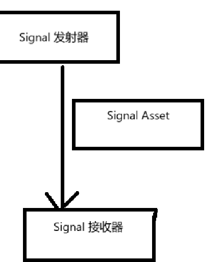
首先是设置Signal发射器

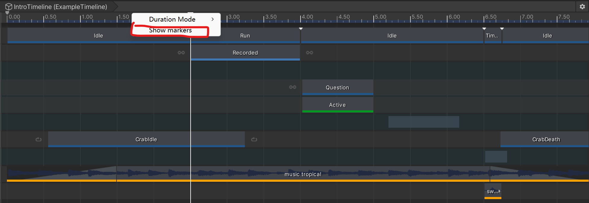

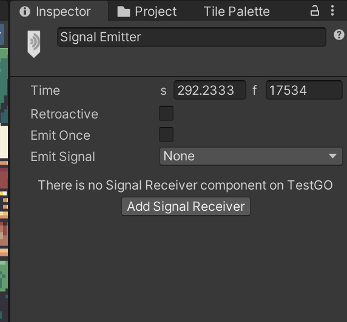
点击之后，我们可以在检视面板中设置它的一些属性，在这里为我们的Timeline实例添加Signal接收器

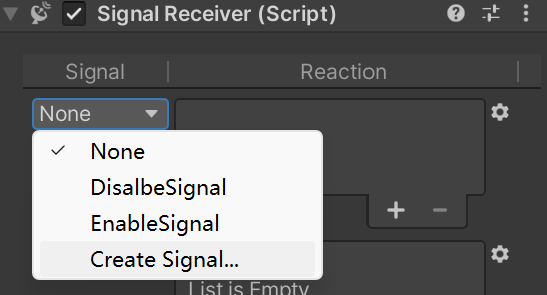

在Signal接收器组件中需要我们来创建Signal Asset 

(这里的DisableSignal与EnableSignal是我之前创建的Signal Asset)

创建好Signal Asset之后，我们就可以为其添加响应函数
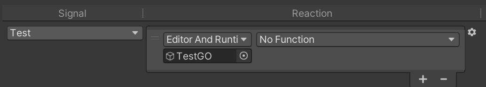
返回Signal 发射器中，为它设置发射的信号
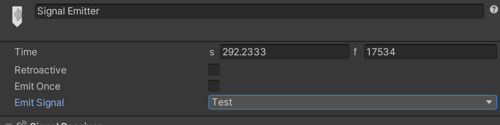
设置完成之后，当时间轴到其位置，即可触发信号
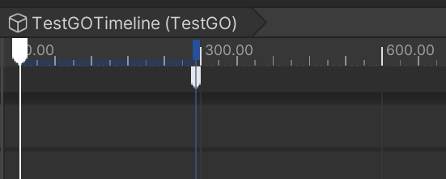

**6、Cinemachine Track**

Cinemachine(虚拟摄像机)

同样的我们选定一个游戏对象 **(拥有CinemachineBrain组件)** ，为其创建一个轨道.
Cinemachine Track轨道需要我们将具有CinemachineVirtualCamera组件的游戏对象拖动到轨道中
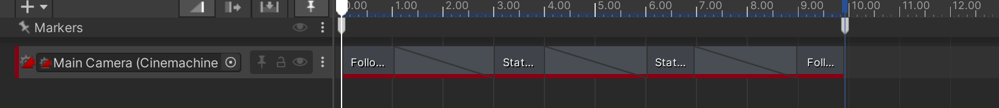
我们可以将它们互相融合，实现从一个镜头渐变至另一个镜头的效果

-----
## 参考
1、[【Unity教程搬运】使用时间轴在Unity中制作精彩的过场动画】](https://www.bilibili.com/video/BV1xk4y1n79d)

2、[CSDN TimeLine的简单使用方法S](https://blog.csdn.net/qq_39435884/article/details/116232225)

3、[Unity Timeline文档](https://docs.unity.cn/Packages/com.unity.timeline@1.8/manual/index.html)