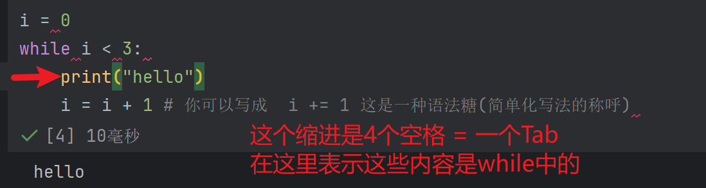

> # 🛕从前有座山，山里有座庙...


我们上次培训使用到的工具是pycharm，属于一种集成式开发环境，在这个开发环境中会集成许多除了单纯编辑代码以外的功能，我们还可以使用ide来写jupyterNote。

在pycharm中创建一个jupyterNotebook：


!!! success
    现在我们有一个.ipynb的文件了

在你创建的jupyterNote中，你可以创建代码块和笔记块，代码块可以交互式执行并且输出结果，如下图：


> ## 循环、函数和递归
>  上次我们学了if和条件判断，在案例中大家或许已经掌握了函数的使用方法，不过下下面要重新展示一遍


# 这是一个打印语句
print("hello")

如果我想打印三次hello呢？
```py
print("hello")
print("hello")
print("hello")
```
但是肯定不会这样做对吧
我们在python中使用两种循环，一种是for循环，一种是while循环

```py
# 使用for循环
for _ in range(3):
    print("hello")
```
这是非常语义化的代码，就不用解释为什么这样做了，如果使用while循环的话

```py
i = 0 
while i < 3:  # while <循环执行的条件>
    print("i")
    i = i + 1 # 你可以写成  i += 1 这是一种语法糖(简单化写法的称呼)
```




可以看到，while 后需要一个语句  ` while <语句>:` 这个语句就是循环执行的条件 

    当这个语句成立时，它会一直**重复**的执行while中的内容

    在i = 0时执行一遍，打印 i 字符，i + 1 再给 i， i = 1 了，满足 i < 3,继续

    在i = 1时执行一遍，打印 i 字符，i + 1 再给 i， i = 2 了，满足 i < 3,继续

    在i = 2时执行一遍，打印 i 字符，i + 1 再给 i， i = 3 了，不满足 i < 3,结束


🤔 那么到这里，你知道怎么从 0 打印到 3 吗？
 
``` py
i = 0
while i < 4:  # 这里不会打印4的
    print(i)
    i += 1
```

``` py
# 对于for循环来说 我们只需要 一个变量在 range(4)以内就循环就可以了
for i in range(4):
    print(i)
```

for 还有很多用法，但本质都是按照 `in` 字段后的内容挨个给 i 赋值

``` py
for fruit in ["apple", "banana"]:
    print(fruit, end=" ")  # 每次用空格作为结尾
    
print() # 不传入 end 参数会默认以 换行符作为 end

for i in range(5, -1, -1):
    print(i, end=" ")
``` 

#### 在这里你可能有一点困惑，不要紧，学完接下来的函数你就理解了

实际上，我们一直在使用的print就是一个函数，属于**具名函数**,顾名思义，我们叫他print函数，当然有名字，并且函数的名字一般要能帮助你理解这个函数的作用

简单来说，定义一个你自己的具名函数只需要几个部分

1. 定义函数的关键字 `def`
2. 函数的参数 (你想要在这个函数中使用的东西)
3. 函数的名字 ~废话~
4. 函数内容 实现你想让函数做的
5. 返回值 (可有可无)

下面定义一个没什么意义的函数，实现我输入 n 就打印 n个 "哈" 的功能

``` py
def print_ha(n):
    for _ in range(n):
        print("哈", end="")
```

运行代码，当然什么都不会发生，因为我们只是定义了还没使用

``` py
print_ha(50)
``` 

yeah! 有了函数就是如此方便，那么我们想打印任何我们传入的 参数 任意次数呢


``` py
# 定义函数
def print_pro(times, char):
    for _ in range(times):
        print(char, end="")

print_pro(10, "*") # 调用
```


非常简单对吧，那么我们想用 * 打印一个三角形呢？

``` py
def print_triangle(d, char):
    for i in range(d):
        print(' ' * (d - i - 1), end='') # 打印空格
        print(char * (2 * i + 1))  # * 是乘法运算符，应该知道？？
        
print_triangle(5, "+")
```

这就是一些函数的入门知识，之后你需要做更多的练习学习更多的用法

> ### 来不及悼念了，接下来要登场的是 -- 递归

生活中有许多递归，例如在谷歌搜索 递归，他会推荐 递归，点进 递归 之后，会进入 递归，并且推荐 递归......

在数学上有著名的斐波那契数列序列，也叫[**兔子序列**](https://baike.baidu.com/item/%E6%96%90%E6%B3%A2%E9%82%A3%E5%A5%91%E6%95%B0%E5%88%97/99145)

其数值为：1、1、2、3、5、8、13、21、34……在数学上，这一数列以如下递推的方法定义：F(0)=0，F(1)=1, F(n)=F(n - 1)+F(n - 2)（n ≥ 2，n ∈ N*）

这个递推函数中就说明了一切，从第 2 位开始，第n位斐波那契数就是它前两位之和

那么如何编写一个递归函数求第 n 位斐波那契数？

递归函数有几个重要的部分：

1. 基准条件(base case)
2. 递归调用
3. 问题简化

我们有技巧练习如何写出递归函数，在2、3步中，只需要做 **信仰之跃** ，意思是我们只需要相信这个函数可以做到我们想让他做的事，放心的去调用它。

那么如何找 base case?
- base case是最简单、无须进一步递归的问题实例 (第一个斐波那契数需要找前两个数相加吗？第二个数需要吗？)
- 无论是哪种递归问题的实例(求第1个，第2个，第100个斐波那契数)，都会到达的最小问题

那么斐波那契的basecase是不是 求第一个和第二个斐波那契数？这两个数是不是就是 1 和 2

知道这些，足以让我们写出递推公式，自然也可以写出递归函数了


``` py
# fib 函数返回( return )第 n 位的斐波那契数
def fib(n):
    if n < 2:  # base case
        return n
    else:
        # 信仰之跃, 相信fib(n-1)返回第n - 1位的fib数，fib(n - 2)返回第n - 2位fib数，自然fib(n)就该返回二者之和
        return fib(n - 1) + fib(n - 2)
```


## 习题(选做，用递归解决)

!!! success
    那么到此为止就这么多内容，下面是一些练习题


### 1. 8出现的次数 
``` py
def num_eights(n):
    """返回 n 中8出现的次数

    >>> num_eights(3)
    0
    >>> num_eights(8)
    1
    >>> num_eights(88888888)
    8
    >>> num_eights(2638)
    1
    >>> num_eights(86380)
    2
    >>> num_eights(12345)
    0
    >>> num_eights(8782089)
    3
    """
    "*** YOUR CODE HERE ***"

```


### 2. 连续的8
``` py
def double_eights(n):
    """返回一个正整数中是否有两个相邻的8

    >>> double_eights(1288)
    True
    >>> double_eights(880)
    True
    >>> double_eights(538835)
    True
    >>> double_eights(284682)
    False
    >>> double_eights(588138)
    True
    >>> double_eights(78)
    False

    """
    "*** YOUR CODE HERE ***"
```


### 3. 数字距离
对于给定的整数，数字距离是连续数字之间绝对差之和。例如：
- 61 数字距离为 5，因为 6 - 1 的绝对值为 5
- 71253 的数字距离是 12 （abs（7-1） + abs（1-2） + abs（2-5） + abs（5-3） = 6 + 1 + 3 + 2）
- 6 的数字距离为 0，因为没有连续数字对。

``` py
def digit_distance(n):
    """
    >>> digit_distance(3)
    0
    >>> digit_distance(777) # 0 + 0
    0
    >>> digit_distance(314) # 2 + 3
    5
    >>> digit_distance(31415926535) # 2 + 3 + 3 + 4 + ... + 2
    32
    >>> digit_distance(3464660003)  # 1 + 2 + 2 + 2 + ... + 3
    16
    """
    "*** YOUR CODE HERE ***"
```
