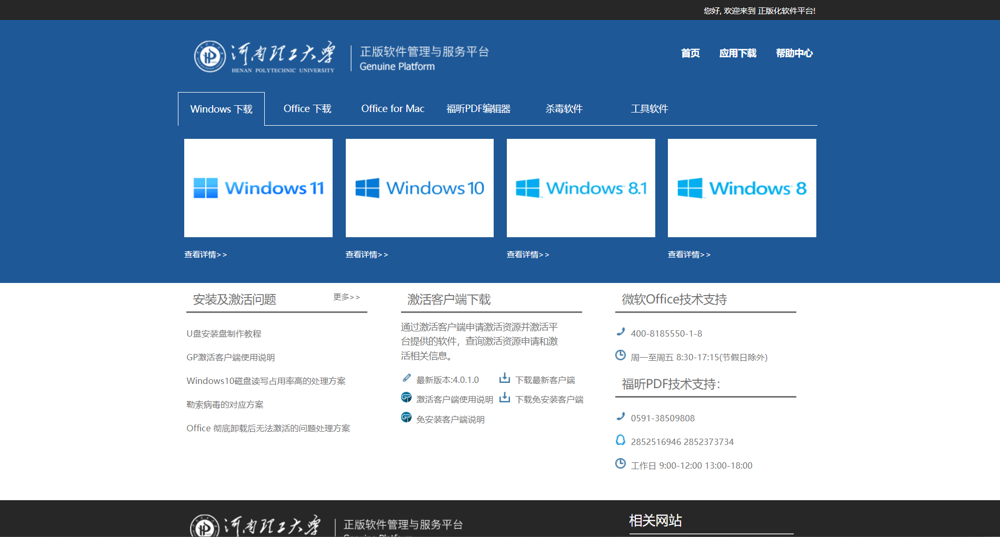
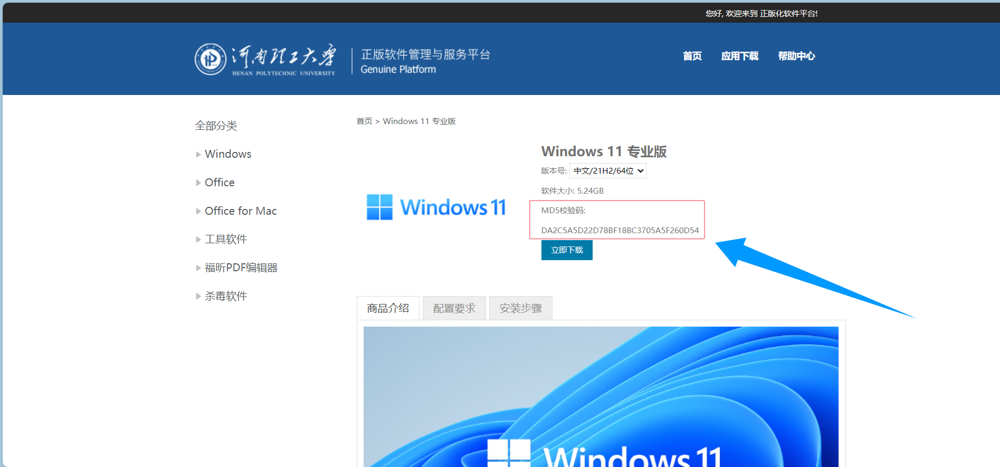
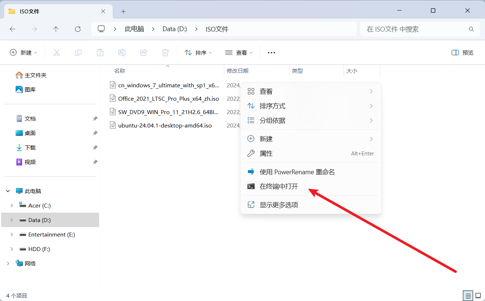
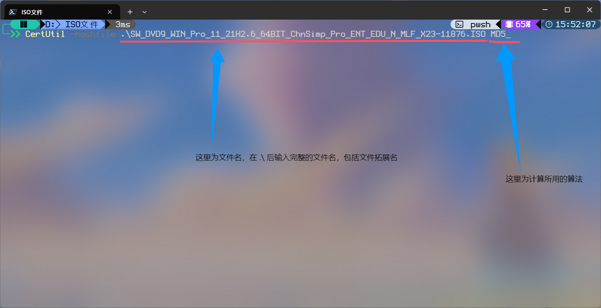
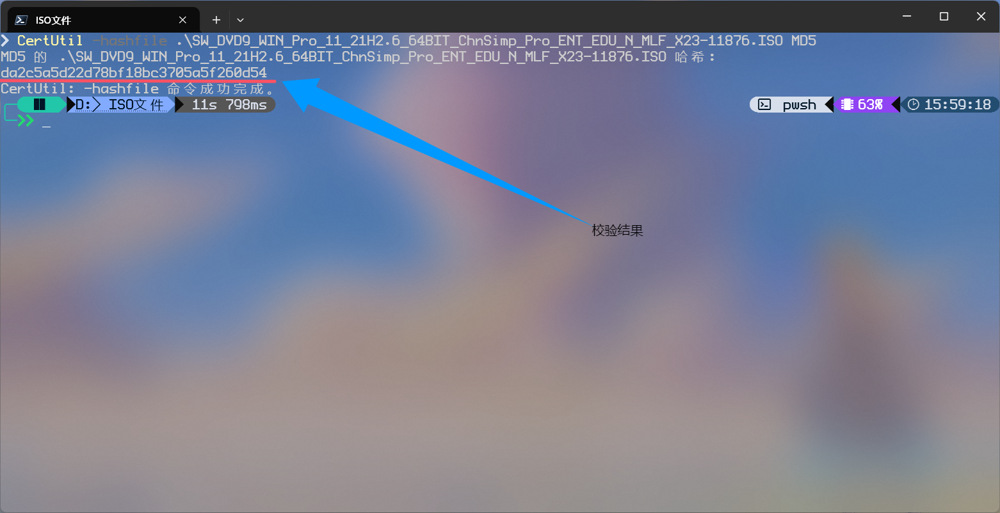

# 河理软件正版化服务

**说在前面☝️🤓**
--- 
&emsp;&emsp;许久之前，笔者在无聊时刷手机，不经意间看到了河理官方公众号发的这样一篇文章：

<!--

编写时预览演示用
-->


<!--
实际网页用
-->

&emsp;&emsp;好奇心作祟，我点了进去。截至笔者写这篇文章的时候，这篇公众号文章页面已经无法打开了，但大致内容是：

&emsp;&emsp;我们的 ~~煤专（bushi~~ 河理买下了一些软件工具及部分操作系统的正版授权，只要能够证明你是本校师生教职工等，便可在在校（在岗）期间使用学校授予的正版许可证使用这些软件和操作系统。

&emsp;&emsp;本文不包含对于系统或是软件安装过程中的所有帮助，仅介绍学校所提供的这个服务与网页及注意事项，具体安装帮助请查阅网站中帮助内容或借助互联网搜集相关信息。


**详细内容🧐**
---

 - **首先，先上资源的链接🔗**：

&emsp;&emsp;**正版软件管理与服务平台（河南理工大学）**

&emsp;&emsp;[**http://ms.hpu.edu.cn**](http://ms.hpu.edu.cn)

&emsp;&emsp;访问不了的，可能是因为没有在学校内网中。

&emsp;&emsp;建议在能连接到学校内网的环境中打开或是使用学校提供的VPN连接到内网以达成外网访问校园内网的功能。

 - **网页介绍**

&emsp;&emsp;打开网页后，大概是这样的情况：
<!--

编写时预览演示用
-->


<!--
实际网页用
-->

&emsp;&emsp;你可以在这里找到想要下载的一些正版资源，包括Windows系统安装镜像，Microsoft Office软件安装包等其他内容，等到你安装成功后，同样可以使用网页内提供的激活客户端来进行正版软件的授权。

&emsp;&emsp;据我所知，学生教职工可以在在校期间享受到数次正版软件激活的权益。

 - **注意事项**


&emsp;&emsp;<span style = "color: red; font-size: 20">下载好的文件一定要进行校验！！！😠</span>

&emsp;&emsp;<span style = "color: red; font-size: 20">下载好的文件一定要进行校验！！！😠</span>

&emsp;&emsp;<span style = "color: red; font-size: 20">下载好的文件一定要进行校验！！！😠</span>

&emsp;&emsp;重要的事情说三遍！！！尤其是系统镜像，尽量养成从网上下载的大型文件进行校验的习惯。虽说现在网络传输丢包或是文件损坏的情况已经很少，但不敢赌那万一啊。

&emsp;&emsp;**笔者曾经血与泪的教训：没有校验就进行了系统安装，在已经清空系统盘的情况下在PE中操作系统镜像进行安装时因为系统镜像文件损坏而导致安装程序无法读取文件导致安装失败，毫无退路可言。~~年少的我最后花了20大洋找人修的,555~~😭**

&emsp;&emsp;关于如何校验文件，网上有很多教程，这里简单给出一种教程：

&emsp;&emsp;首先，一般官网或是有良心的下载站/镜像下载站都会在目标文件的地方放出校验码（shasum，sha1，sha256等），以便你在下载完成后在本地进行校验。

&emsp;&emsp;以我们在我们学校正版网站上下载的Windows 11专业版的iso镜像为例：

<!--

编写时预览演示用
-->


<!--
实际网页用
-->

&emsp;&emsp;记下这个MD5校验码，待会与我们稍后计算出的MD5码进行对比。

&emsp;&emsp;<span style = "color : #3579E6">DA2C5A5D22D78BF18BC3705A5F260D54</span>

&emsp;&emsp;打开你的下载文件夹，在里面空白处鼠标右键打开菜单，单击“在终端中打开”（或是先启动终端cd到该目录，cmd也可以）。

<!--

编写时预览演示用
-->


<!-- 
实际网页用
-->

&emsp;&emsp;到达路径后，在终端中输入如下命令：

```pws
CertUtil -hashfile .\SW_DVD9_WIN_Pro_11_21H2.6_64BIT_ChnSimp_Pro_ENT_EDU_N_MLF_X23-11876.ISO MD5
```
<!--

编写时预览演示用
-->


<!--
实际网页用
-->

&emsp;&emsp;文件名因你下载的文件而异。然后回车，等待一段时间后便会有如下界面：

<!--

编写时预览演示用
-->


<!-- 
实际网页用
-->

&emsp;&emsp;计算出的校验结果为<span style = "color: #B079E5">da2c5a5d22d78bf18bc3705a5f260d54</span>

&emsp;&emsp;此时，将这一串结果与我们事先记录的网页中的MD5校验码进行比对（不区分大小写），发现完全一致，那么这个文件在下载中便没有损坏，可安心安装。若发现损坏，重新下载文件，重复以上步骤。

**结语**
 ---
&emsp;&emsp;我们的学校紧跟软件正版化步伐，给我们提供了正版资源，初衷是让我们能够享受到正版化浪潮的福利。

&emsp;&emsp;笔者也一样，我最初也只是为了将自己笔记本自带的Windows 11家庭版更新为专业版，使我能够使用专业版系统所带的远程桌面服务，带来了许多便利。另外，pdf编辑器也是其中之一。对pdf文件操作修改等在其他软件中大多数是收费的，学校所提供的正版软件能够使用到这些功能。

&emsp;&emsp;文章就到这里，如果喜欢的话或是有什么想说的，请在网页下方留言区中留下你的评论！❤️❤️❤️