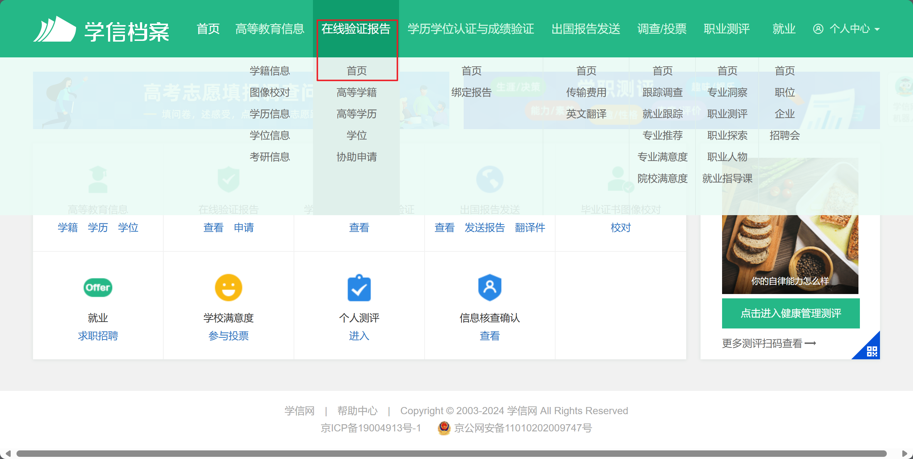
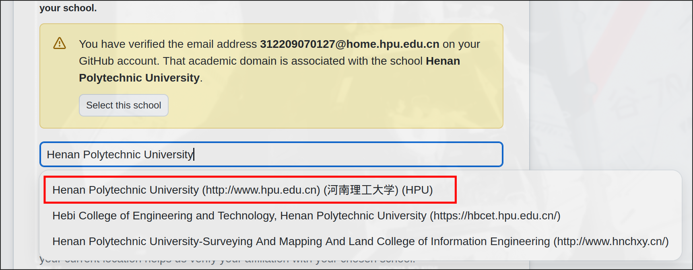

## 学生认证&教育邮箱

&emsp;&emsp;建议大家使用edu邮箱去github进行学生认证，因为咱们学校一早就有人用过hpu域名的教育邮箱认证过了，他们资料库中也有咱们学校

### 1. 从[**这里**](https://mail.hpu.edu.cn/)进去**注册**理工大域名下的教育邮箱，注意是注册不是激活

### 2. 登录[学信网](https://my.chsi.com.cn/archive/index.action)下载在线认证报告，之后当材料交了

### 3. 之后你需要在你的github上面添加以及验证教育邮箱,这个在github setting/email中 [**here**](https://github.com/settings/emails)

!!! warning annotate "注意" 
 
    在定位之前把[梯子](../essentialTools/ladder.md)关掉, 如果你上不了github,可以使用一些更改host的软件(1)

1. [steam++](https://steampp.net/)   待补充...

### 4. 前往[**github education**](https://education.github.com/discount_requests/application)

添加了教育邮箱他会找到你的大学

### 5.之后跟网页提示来就行，但是注意后面上传图片的大小是有要求的，你可裁剪图片，那个花边框完全可以裁掉

 

---

###### **你也可以看下面的视频获得更详细的教程：**

<iframe width="670" height="376" src="//player.bilibili.com/player.html?isOutside=true&aid=992768666&bvid=BV1Ts4y1o7hc&cid=1033020095&p=1&autoplay=0" scrolling="no" border="0" frameborder="no" framespacing="0" allowfullscreen="true"></iframe>
