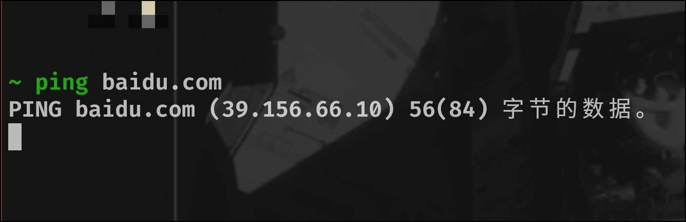

# 问题: 一些网站可以用手机热点可以访问，但校园网不行


首先这不是个难以解决的问题，你可以切换网络或者使用手机热点

## 但是有更好的解决方案吗？&emsp;&emsp;有

### 为什么会这样

&emsp;&emsp;如果你查看现在使用的dns服务器

```shell
# HPUWNET
~ ❯ cat /etc/resolv.conf
# Generated by NetworkManager
nameserver 218.196.240.18  # 两个都是中国教育网
nameserver 218.196.240.8

```

显然是教育网问题，但原因我不知道，如果你切换HPULIB和HPUNET这两个网络会发现这两个网络是可以的，如果你对比dns会发现他们的dns不同，你可以根据不同找到那个能用的dns服务器ip。
后来我在找资料的时候看到有老哥将dns配置成OpenDNS解决了，[指路](https://bbs.archlinuxcn.org/viewtopic.php?id=5129)


<br>

### 如果你不知道dns

&emsp;&emsp;DNS(Domain Name System),简单来说，它将域名映射到ip。当我们使用域名(baidu.com)访问网络上的其他主机时，是需要dns服务器将域名解析为ip地址
`你可以将ip地址当作每一个主机在互联网上的地址，通过地址你才可以访问到这些主机`，之所以这样做是因为一串32位(ipv4)的地址太难记了。



<center> 百度的ip地址 </center>

你可能会好奇上面的那些像素是什么


<center> 是宝可梦的脚 </center>


<br>

#### 1.修改dns/换校园网(HPUWNET❎  HPULIB✅)  你可以自己先查看设备当前使用的dns服务器
如果想要修改dns服务器，无论是linux还是windows、mac网上都有很多详细的教程，这里暂时不放了
#### 2. 更改代理
详见[**翻墙**](../essentialTools/ladder.md)


!!! tip

    有一点需要注意，使用**透明代理**还是会使用本机的dns(不合格的vpn也会)其他如http/https代理，socks代理，dns解析都会被接管
