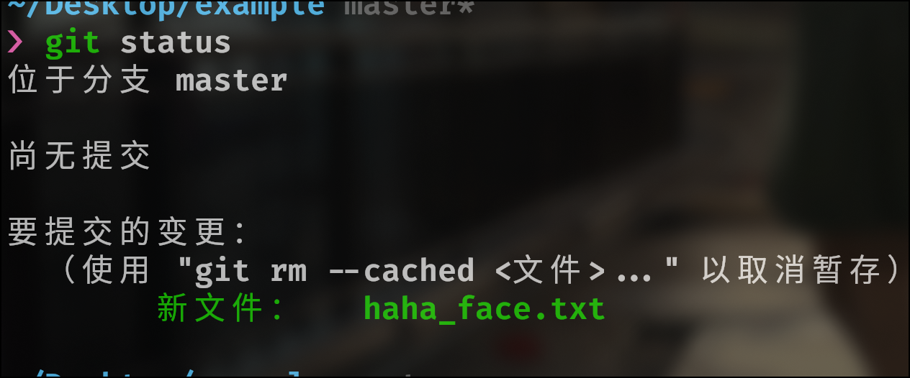
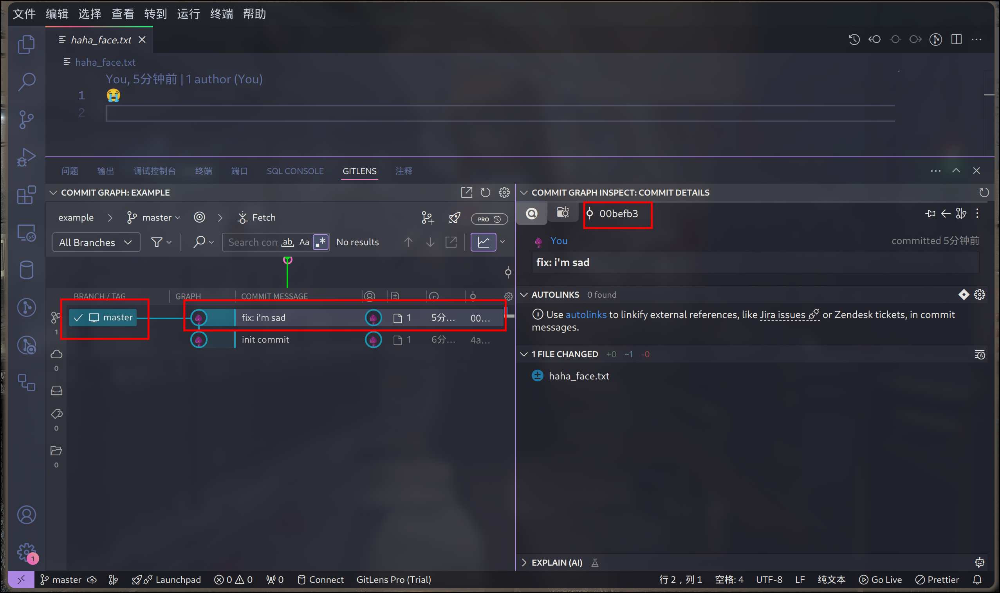

> # 🎏人面不知何处去，桃花依旧笑春风

目录

- [快速上手](#_2)
    - [创建本地仓库](#_3)
    - [创建远程仓库](#_4)
    - [关联远程仓库](#_5)
- [gitFlow](#gitflowgit)

---

## 快速上手

下面将介绍你在使用git ==80%== 时间会使用到的内容


### 创建本地仓库

如果你为本地的一个项目创建管理仓库并且关联到github仓库。

为了数据安全，我们先创建一个新的项目文件吧！你可以按照下面的步骤：

首先,进入文件的根目录

``` bash
# 在项目的根目录中

git init

```

这个时候你就拥有了一个空本地仓库, 如果将这个步骤类比照相来记忆，此时我们已经有了一个空的相册, 下一步，是选择你拍照的对象，将这些内容放入相机的镜头之中


当前项目是空的，先创建一个文件吧

???+ note 

    ``` bash
    
    echo "😃" > haha_face.txt 

    ```

添加文件

``` bash

# 将当前目录所有文件添加到仓库

git add .

# 选择性添加某个文件

git add ./example/example.txt

```

!!! tip

    大多数时候，我们只有少部分文件或文件夹不需要使用git管理，这个时候我们一般都会编写.gitignore文件放心使用`git add .`，而不是多次添加指定文件


现在，你已经可以跟踪这个文件了，使用`git status`你可以看到当前仓库的状态





ok,现在你已经完成了haha_face文件，就好像是相机对准一张笑脸并且拍好了照片，让我们把它洗出来放入相册吧

``` bash

# -m 短参数 意思是massage 写你这次提交的信息 这会在将来某个时间帮助到你

git commit -m "add: haha_face"

```

现在使用`git status`看看有什么不同


现在我心情不好了，不想看到任何一张笑脸

请你使用命令


``` bash

echo "😭" > haha_face.txt ; 

```

!!! danger

    现在使用`cat haha_face.txt`,你会发现笑脸不在了, 因为 `>` 是覆盖写入， 如果你不想之前的内容消失你需要使用 `>>` 追加写入

现在使用`git status` 你会看到现在已经修改的文件


``` bash

# ⚠️注意 这种方式之适合已经被跟踪的文件 

git commit -a -m "fix: i'm sad"

```
``` bash

# 使用下面这种方式无论是未跟踪还是已跟踪的文件都会被添加

git add .
git commit -m "提交信息"

```

!!! note

    如果你项目中的文件内容和更改是非常多的，git可以使用diff算法在每次更改中跟踪和记录仓库中所有文件的修改，也就是保存了你项目的不同版本但只使用极少的空间


现在已经有两个提交记录了，以后有更多的提交记录时，你可以移动HEAD回到任意一个历史上，在git 历史记录中，每个提交都可以看作是一个Node对象，你可以使用`git log` 查看这些历史，也可以在ide中使用插件。





``` shell

❯ git log                        
commit 00befb3f060542789da83914013e25f28b927f2a (HEAD -> master
)
Author: disjfjdizmfnkf <3037650079@qq.com>
Date:   Sun Oct 13 14:21:50 2024 +0800

    fix: i'm sad

commit 4ac9c7a67b86dfba3befbe9b1330da4aff491d2b
Author: disjfjdizmfnkf <3037650079@qq.com>
Date:   Sun Oct 13 14:21:09 2024 +0800

    init commit

```


无论是哪种方式，你都可以看见这些Node的关键信息，其中sha值是使用每个节点独一无二的标识(例如上面的00befb3f060542789da83914013e25f28b927f2a)，使用`git checkout <哈希值/分支>`，可以一移动HEAD到某个节点或者分支


!!! success "阶段一"

    看到这里，你已经学习了：

    - `git init`: 在当前目录中创建一个空的本地仓库
    - `git add <文件或者目录>`: 将文件加入暂存区 
    - `git commit -m "提交信息"`: 提交文件到本地仓库
    - `git status`: 查看暂存区的状态
    - 文件的三种状态


### 创建远程仓库

登陆[github](https://github.com)之后,点击右上角的 "+" 按钮，选择 "New repository"（新建仓库）。

在创建仓库页面，输入以下信息：

1. Repository name（仓库名称）：输入你希望的仓库名称。
2. Description（描述）：可选项，输入仓库的简短描述。
3. Public/Private（公开/私有）：选择该仓库是公开还是私有。
4. Initialize this repository with a README（用README初始化仓库）：可以选择是否添加README文件。
5. 完成后，点击 "Create repository"（创建仓库）按钮。

### 关联远程仓库

在本地仓库中，使用以下命令将本地仓库与刚创建的远程仓库关联：

``` bash

# 将 <URL> 替换为你在GitHub上创建的仓库的URL
git remote add origin <URL>

```

例如

``` bash
git remote add origin https://github.com/username/repository.git
```

验证远程仓库是否关联成功：

``` bash
git remote -v
```
你应该会看到类似以下的输出：


``` bash
origin  https://github.com/username/repository.git (fetch)
origin  https://github.com/username/repository.git (push)
```
接下来，你可以将本地的提交推送到远程仓库：


``` bash
git push -u origin master
```

## gitFlow(git的工作流)
GitFlow 是一种分支管理模型，旨在使 Git 工作流程更高效。它通过定义分支的使用和命名规则来简化开发流程，尤其适合大型项目。以下是 GitFlow 的基本概念和步骤：

### 分支类型

1. 主分支 (master)：始终保持可发布的状态。
2. 开发分支 (develop)：用于集成所有功能分支，进行测试和开发。
3. 功能分支 (feature)：从开发分支派生，用于开发新功能，完成后合并回开发分支。
4. 发布分支 (release)：从开发分支派生，准备发布新版本，修复bug，完成后合并到主分支和开发分支。
5. 热修复分支 (hotfix)：从主分支派生，用于快速修复生产环境中的问题，完成后合并到主分支和开发分支。

### 工作流程

<!-- TODO: 修改目录跳转问题/ 创建远程仓库/关联远程仓库 -->