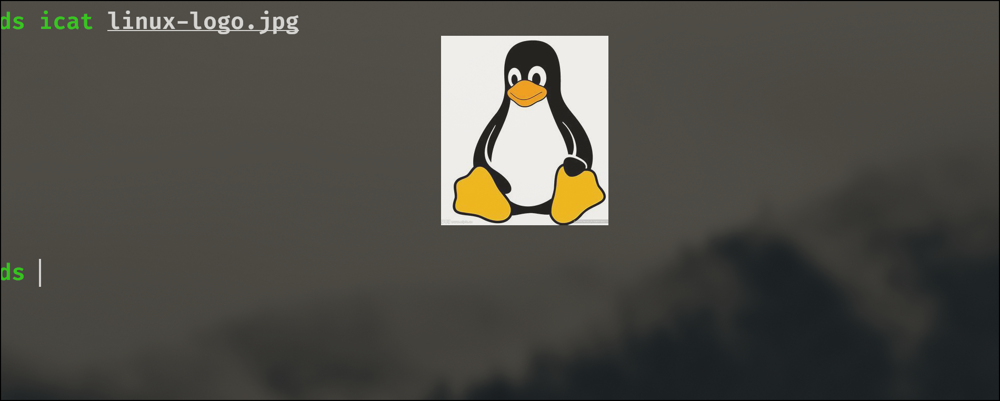

没写完

    这部分表面是讲终端，但是重点应该是shell

# terminal(终端)

## what/什么是终端?
常用的terminal, iterm, kitty, foot, konsole等就是终端，它的最大作用就是提供我们和shell交互的环境，提供输入和输出

> **举个例子** windows terminal本身不支持在终端显示图片，但是kitty可以

## why/为什么要学会使用终端?

因为需要通过terminal更好的与shell交互，指令都需要在shell中执行

# shell(壳)

## what?
shell

## why?

## how?