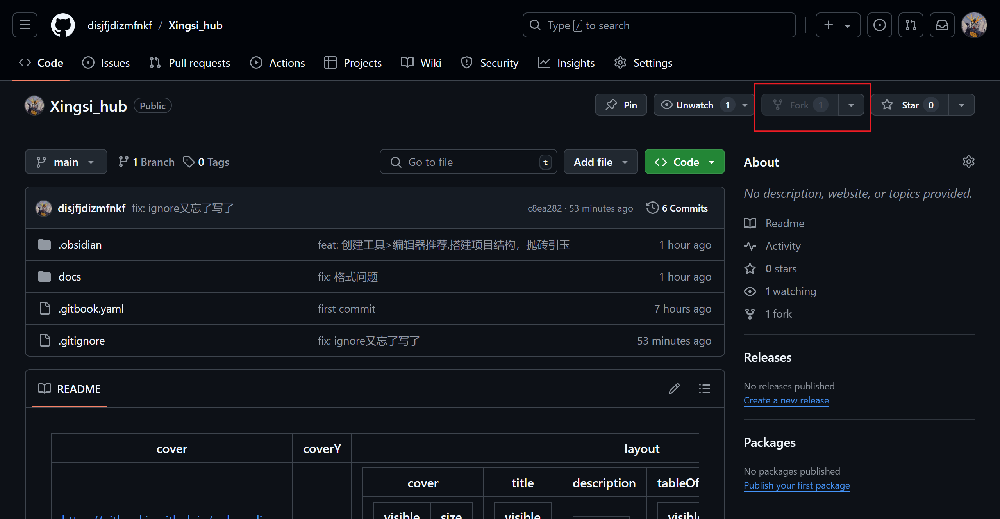

## 众人拾柴火焰高, 强烈建议您成为编辑者!!🚀


## 1. 点击[项目地址](https://github.com/disjfjdizmfnkf/Xinsi_hub), fork

{loading=lazy}
<center> fork项目 </center>


&emsp;&emsp;你会看到自己的仓库中有这个派生仓库

## 2. **clone 派生仓库**


!!! warning "注意"

	记得要进入自己的仓库中克隆，不要克隆原始仓库


{loading=lazy}
<center> 进入自己的仓库 </center>


&emsp;&emsp;使用一种方式clone就行了
{loading=lazy}
<center> clone </center>


## 3. **编辑** 

!!! success 

	现在你就可以在你的项目中写文档了


## 4. **git push**

&emsp;&emsp;这是一个基本的git技能，不再赘述。
常用流程

+ git pull
+ git add .
+ git commit -m "简单描述你添加了哪些内容“
+ git push

## 5. **提交pr**

	回到个人仓库提交pr即可，记得在pr中写一下你做了哪些修改, 之后就没事了

## 其它信息补充：

### 项目文件布局

```
mkdocs.yml    		# 配置文件，所有网站配置都在这里
docs/
	mkdocs/
		overrides/	# 覆盖 mkdocs 网站的底层样式
		css/		# 放置额外的 css 文件
		js/			# 放置额外的 js 文件
    index.md		# 文档 Home 主页面
	.meta.yml		# 文件元数据设置
    img/            # 图片，注意分类保持项目整洁
	...       		# 其他 markdown 页面，图片和其他文件
```

### 安装Mkdocs进行本地调试
&emsp;&emsp;如果您想调试方便,请安装mkdocs

无论是windows,linux,还是macOS都是使用python自带的pip包管理工具安装的

但是注意--mkdocs的构建需要python版本>3.0

??? example "检查python版本"

	```shell
	# 查看 Python 版本
	python --version
	# 如果 Python 版本 < 3.0，下面是一种更新方法：

	# 1. 访问 Python 官方网站：https://www.python.org/
	# 2. 下载适用于您的操作系统的最新 Python 安装包。
	# 3. 运行安装包并确保勾选“Add Python to PATH”选项。
	# 4. 完成安装后，打开命令提示符（Cmd）或 PowerShell，运行以下命令以验证当前版本：
	python --version

	# 更新 pip：
	python -m pip install --upgrade pip

	```

#### 下载mkdocs

```shell

pip install mkdocs

```


#### 安装依赖项
```shell
# 依赖文件在根目录中

pip install -r ./requirements.txt

```

#### 本地运行
```shell
mkdocs serve
```

> 如果你使用是centOS 7 这种已经停止更新的linux发行版，yum还是用python2写的，注意更新完后python后不要将旧的python2删了，不然包管理工具会用不了...

#### Mkdocs 常用命令

* `mkdocs serve`：启动实时加载的文档服务器

* `mkdocs build`：创建文档站点

* `mkdocs -h`：打印帮助信息并退出


!!! warning "注意"

	项目使用githubActions CI/CD, 项目的目录结构与 开发/使用mkdocs打包 不同, 注意图片的引用路径