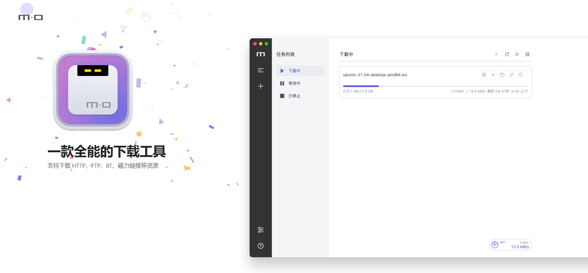
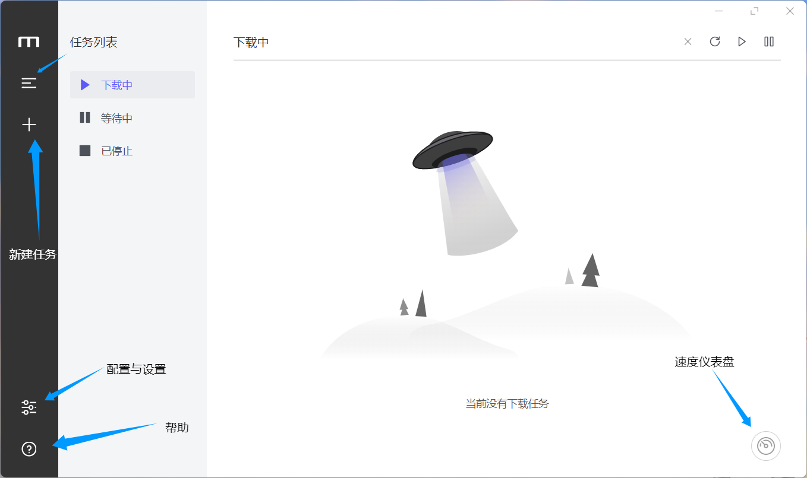
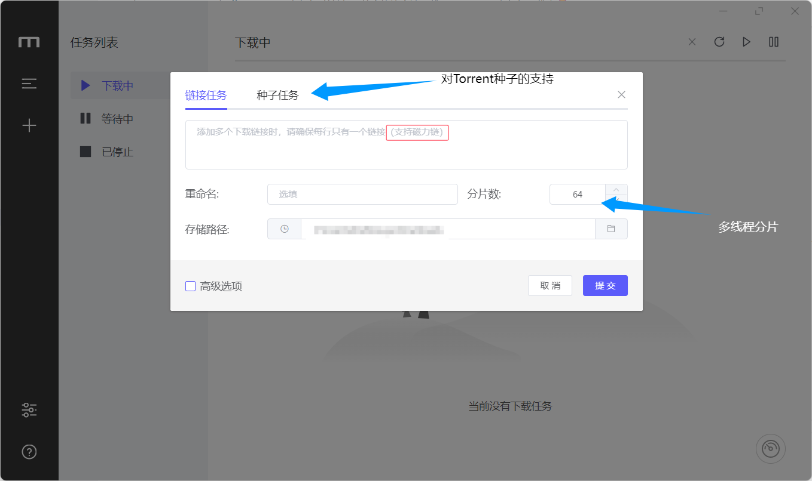
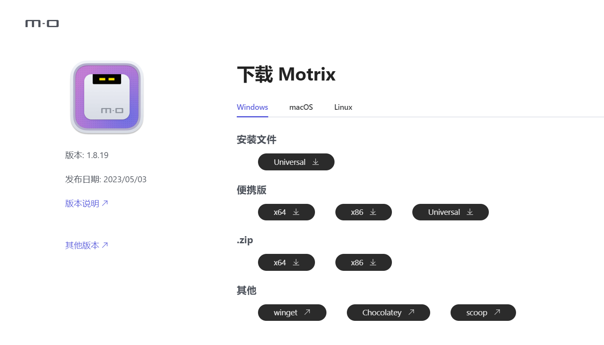

# 简洁好用的多协议高速下载器——Motrix
 - 你是否对浏览器自带的默认单线下载方式产生厌倦？🤨
 - 是否下载不了磁力链和种子方式的文件，且不想饱受吸血雷的困扰？😩
 - 当今市面上的下载器颇多而挑不过来？想找到一款简洁高效的下载软件？🥺

**向你隆重介绍——Motrix，一款简洁有效的多协议高速下载器！**

<!-- 

编写时预览演示用
-->

<!-- 
实际网页用
-->

特点🤩：
---

 - **界面简洁美观，符合现代审美**

    &emsp;&emsp;一如上面介绍图所展示，它的界面十分的干净简洁，没有许多下载器所特有的冗杂花哨的界面和漫天的广告，它遵循了一个下载器所应有的本心，简单高效。主题也只是简单的深浅色互换，也可跟随系统主题所变换。

<!--

编写时预览演示用
-->

<!-- 
实际网页用
-->

 - **功能齐全，支持多线程多协议下载**

   &emsp;&emsp;这款软件在如今选择了大多数HTTP下载器所少见的多协议支持，尤其是对于老旧的FTP协议及磁力链协议乃至种子下载的支持，对于磁力链和种子下载的缺陷——Tracker服务器的丢失断连也提出了解决方案，它能够每天更新Tracker服务器。另外，支持多线程下载，使得在下载时网络资源利用率得以有效提高，可以轻松地跑满带宽。

<!--

编写时预览演示用
-->

<!-- 
实际网页用
-->

 - **开源免费，多系统支持**

    &emsp;&emsp;在上面优点的加持下，这款软件甚至还是开源免费的，另外对于目前的主流PC操作系统都有了很好的支持（Windows、macOS、Linux），这样可以满足不同系统用户的需求。

<!--

编写时预览演示用
-->

<!-- 
实际网页用
-->

作者碎碎念☝️🤓：
---

**这是作为本站站主的特邀工具人（bushi）写的第二篇好用工具推荐文，工具推荐文的更新是随缘的**

~~才不是站主一直在强迫我更新~~

**喜欢的话可以在网站中留下你的评价和留言❤️❤️❤️**

官网、下载链接🔗：
--- 

**Motrix**

[**https://motrix.app/zh-CN/**](https://motrix.app/zh-CN/)

**项目Github地址 “agalwood/Motrix: A full-featured download manager.”**

[**https://github.com/agalwood/Motrix**](https://github.com/agalwood/Motrix)

